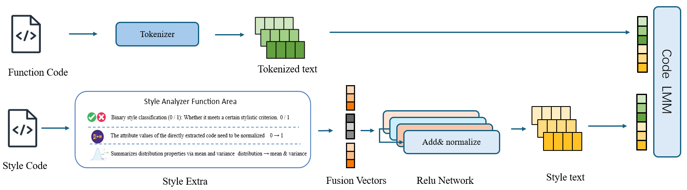

Here is the English version of the README file for your Style2Code project:

# Style2Code

**Style2Code** is a style-controllable code generation framework that integrates explicit style vector extraction, contrastive representation learning, and the powerful generation capability of large language models. Unlike previous approaches that rely on implicit style cues or handcrafted templates, Style2Code encodes the code style explicitly as continuous vectors, achieving fine-grained, interpretable, and user-controllable code style transfer and generation.

📄 Paper: [arXiv:2505.19442](https://arxiv.org/abs/2505.19442)
📦 Hugging Face Model Checkpoint: [Visit here](https://huggingface.co/DUTAOZHANG/Styele2Code_model2/upload/main)
📦 Training Dataset: Not yet released
[English version](README.md) | [中文版](README_zh.md)

---

## 🚀 Project Features

✅ **Two-stage training process**:

* Stage 1: Train a style encoder using contrastive learning to extract discriminative style vectors.
* Stage 2: Freeze the style encoder and fine-tune the decoder for style-controlled code generation.

✅ **Explicit style vector injection**:
Directly fuses the 34-dimensional explicit style vector with the input code to improve the controllability and stability of the generated code.

✅ **Support for multi-dimensional style features**:
Covers naming style, structural layout, whitespace patterns, and more, allowing flexible style adaptation across different code generation tasks.

✅ **Multi-metric evaluation**:
Uses BLEU, ROUGE, and CSS (Code Style Similarity) to comprehensively evaluate functional and stylistic consistency of the generated code.

---

## 🏗️ Model Architecture & Training

Style2Code is based on the Flan-T5 language model and includes:

* **Style Encoder**: BiGRU + MLP architecture to extract explicit style vectors (34 → 1024 dimensions).
* **StyleControlledGenerator**: Injects the style vector as a pseudo token into the decoder.
* **Contrastive loss + style loss**: Ensures the consistency of the style vector and the decoder’s style adaptation.

For detailed architecture diagrams, loss functions, and visualization results, please refer to the paper and the `docs/` folder.

---

## ⚙️ Installation & Usage

```bash
# Clone the project
git clone https://github.com/your_username/Style2Code.git
cd Style2Code

# (Optional) Create a virtual environment
python -m venv venv
source venv/bin/activate

# Install dependencies
pip install -r requirements.txt
```

### 🔍 Inference

Modify the file paths in `run.py`, then run:

```bash
python run.py
```

### 🏋️‍♂️ Stage 1 Training

```bash
python train_stage1/train_stage1.py
```

### 🏗️ Stage 2 Training

```bash
bash train_stage2/run_ddp.sh
```

### 📊 Evaluation

```bash
python eval/runner.py
```

---

## 🔗 Pre-trained Model

We have shared pre-trained Style2Code model weights on Hugging Face for fine-tuning on downstream tasks:
👉 [Model checkpoint](https://huggingface.co/DUTAOZHANG/Styele2Code_model2/upload/main)
👉 [Train checkpoint](https://huggingface.co/datasets/DUTAOZHANG/Style2Code_datasets)
---

## 📄 Citation

If you use Style2Code in your research, please cite the following paper:

```bibtex
@article{zhang2025style2code,
  title={Style2Code: A Style-Controllable Code Generation Framework with Dual-Modal Contrastive Representation Learning},
  author={Zhang, Dutao and Kovalchuk, Sergey and He, YuLong},
  journal={arXiv preprint arXiv:2505.19442},
  year={2025}
}
```

---

## 📬 Contact

For questions or collaboration, please open an issue or contact via email:

* ✉️ [zh19980811@gmail.com](mailto:zh19980811@gmail.com)

Let’s make code more stylish together! 🎨
