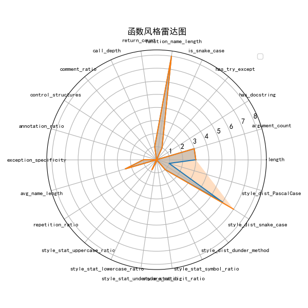
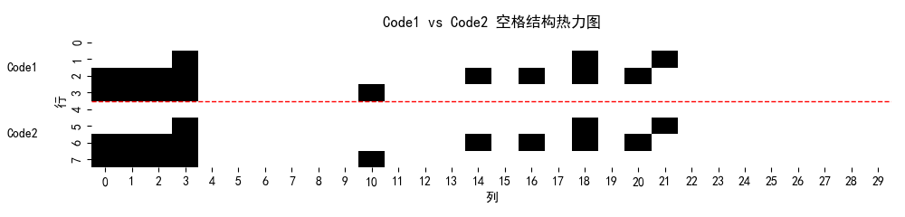
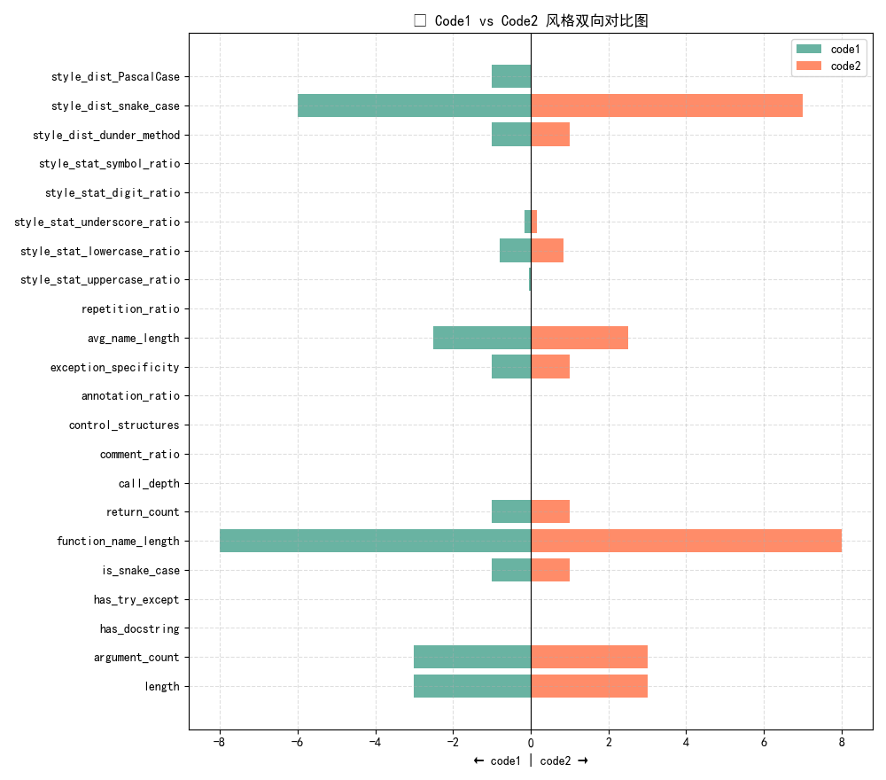

# 📘 Code Style Evaluator

A tool for comparing and evaluating Python function style across multiple quantifiable dimensions such as naming, structure, and spacing consistency.

一个用于比较和评估 Python 函数风格的分析工具，支持命名规范、结构风格、排版一致性等多个维度的量化评分。

---

## 🔍 Features | 功能概览

- ✅ Structured style scoring (24+ metrics) | 结构化风格评分（24+ 项指标）
- ✅ Function-level evaluation, naming style, comment density | 支持函数级评分、命名风格、注释率等
- ✅ Space pattern encoding via `space_pattern_code2` | 空格结构分析：使用 `space_pattern_code2` 编码目标缩进风格
- ✅ Visualization: radar, bar, and scatter plots | 支持可视化图表（雷达图、柱状图、散点图）
- ✅ Export results to CSV | 输出 CSV 表格

---

## 🧠 Spacing Pattern Encoding: `space_pattern_code2`

This field encodes the visual structure of indentation per function:

本工具采用 `space_pattern_code2` 字段作为结构风格核心向量：

- Each line becomes a fixed-length binary string (1=space, 0=non-space) | 每行是一个 01 串，表示空格位置
- Concatenated lines form the visual signature of code layout | 所有行组合形成函数缩进结构的“视觉签名”
- Useful for training style models, clustering, etc. | 可用于风格聚类、迁移、分类模型训练

Example 示例：
```text
111100000000000000000000000000
000000000000000000000000000000
111111110000000000101010100000
...
```

---

## 📦 Usage | 使用方式

```bash
python -m examples.demo
```

Or view the `examples/demo.py` file | 或查看 `examples/demo.py` 文件：
```python
from benchmark.analyzer import export_code_metrics

df = export_code_metrics(code1, code2)
```

This generates `function_style_metrics.csv` containing all metrics and vectors.
将生成 `function_style_metrics.csv`，包含函数评分 + 风格向量。

---

## 📊 Output Fields (28 Metrics) | 输出字段说明（完整 28 项指标）

| Field | Description | 字段名 | 含义 |
|-------|-------------|--------|------|
| `function_name` | Function name | 函数名 | 函数名 |
| `score` | Overall structure score | 综合评分 | 综合评分（结构维度）|
| `comment_ratio` | Comment lines / total | 注释率 | 注释行数 / 总行数 |
| `call_depth` | Max call nesting | 嵌套深度 | 最大嵌套调用深度 |
| `name_length` | Avg name length | 命名长度 | 平均命名长度（函数+变量）|
| `branch_count` | Number of branches | 分支复杂度 | 分支数量（if/for/while）|
| `type_hint_ratio` | Parameters with type hints | 类型注解率 | 类型注解覆盖率 |
| `exception_score` | Specificity of exception handling | 异常处理得分 | 异常处理精准性得分 |
| `redundancy_ratio` | Code redundancy | 重复比率 | 重复结构比率 |
| `return_count` | Number of return statements | return 数 | return 语句数量 |
| `has_docstring` | Has docstring or not | 是否有 docstring | 是否有函数 docstring |
| `has_try_except` | Contains try/except | 是否有异常处理 | 是否包含异常结构 |
| `arg_count` | Number of arguments | 参数数量 | 参数数量 |
| `length` | Number of lines | 函数长度 | 函数行数 |
| `is_snake_case` | Is name snake_case | 是否 snake_case | 函数是否 snake_case 命名 |
| `space_pattern_code2` | Space pattern matrix (01) | 空格结构编码 | 结构风格编码（目标缩进01矩阵）|
| `style_stat_uppercase_ratio` | Uppercase char ratio | 大写字符占比 |
| `style_stat_lowercase_ratio` | Lowercase char ratio | 小写字符占比 |
| `style_stat_underscore_ratio` | Underscore ratio | 下划线占比 |
| `style_stat_digit_ratio` | Digits in names | 数字占比 |
| `style_stat_symbol_ratio` | Special char ratio | 特殊字符占比 |
| `style_dist_PascalCase` | PascalCase names | PascalCase 命名个数 |
| `style_dist_snake_case` | snake_case names | snake_case 命名个数 |
| `style_dist_camelCase` | camelCase names | camelCase 命名个数 |
| `style_dist_UPPER_CASE` | UPPER_CASE names | UPPER_CASE 命名个数 |
| `style_dist_private` | _private names | 下划线私有命名个数 |
| `style_dist_dunder_method` | __dunder__ methods | 魔术方法命名个数 |

---





